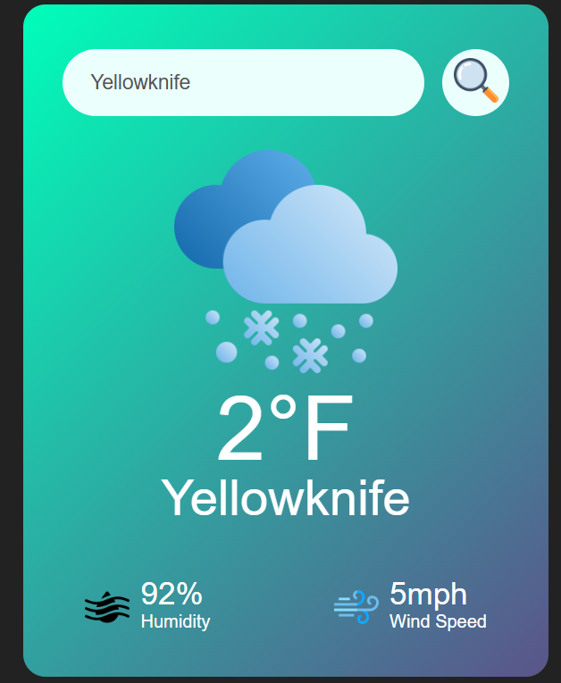

# Weather App 🌦️

A simple and user-friendly weather application that allows you to search for the current weather of any city in the world. Built with HTML, CSS, and JavaScript, this app fetches live weather data using a public API.

  
  
*Example of the weather app in action.*

---

## Features
- 🌍 Search weather for any city worldwide.
- 📊 Displays temperature, weather condition, and more.
- 💻 Responsive design for a smooth experience across devices.

---

## How to Use
1. Clone this repository to your local machine:
   ```bash
   git clone https://github.com/yourusername/weather_app.git
